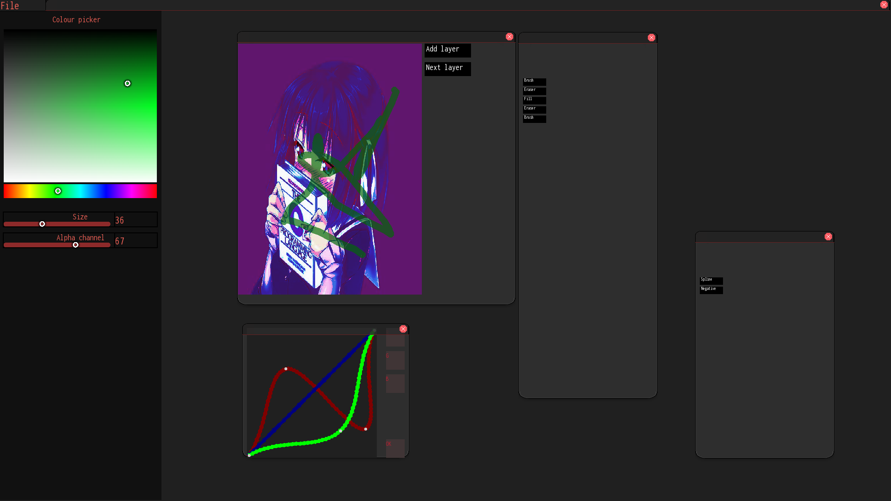

# Small graphic editor

## Disclaimer
Work in progress
## Description
Educational project of the third semester. The main goal of this project is learning concepts and techniques of object-oriented programming.

### Currently implemented:
1. Palette of choice of color and brush size. 
2. Simple canvas.
3. Simple text box.
4. Opening images via filename in a text box.
5. Abstract spline widget

### To do list
1. Create simple user interface
2. Add layers for canvas
3. Add widget which provides different tools
4. Add a system of plugins that modify the image


### Screeenshot of current version


## Requirments:
1. SFML - latest version
2. g++ (GCC) 11.1.0
## Build
For buildung this project you need to type
```sh
make init
make
```
The executable file is located in the "bin" folder and its name is "editor"
